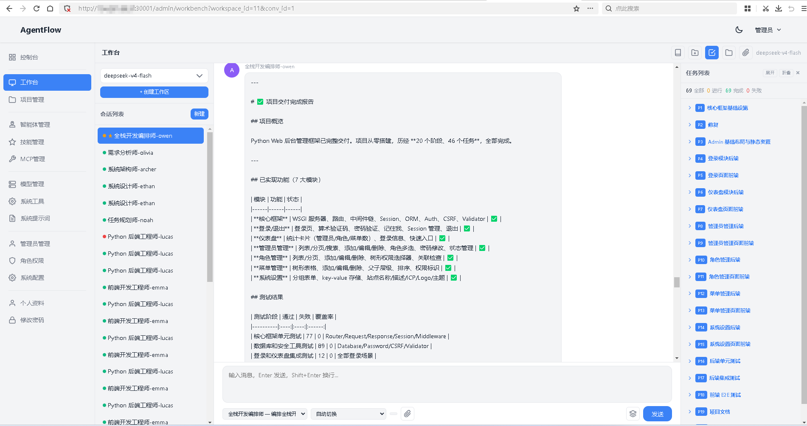
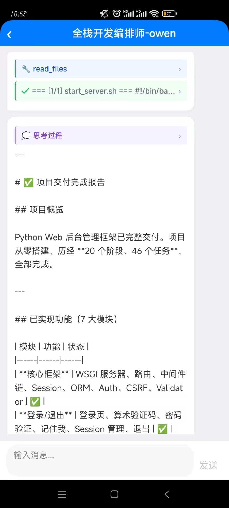

# AgentFlow

[中文文档](README_zh_cn.md)

An out-of-the-box AI agent workflow system built with Go. Single binary deployment with embedded frontend and SQLite database.

## Sponsors

| | Sponsor | Description |
|--|---------|-------------|
| 🖥️ | [弘速云](https://www.hosuyun.cn) | 香港高性能云服 8核8G 19.9/月 |
| 🔑 | [Synai996 AI Gateway](https://synai996.space) | 稳定接入 Claude、GPT、Gemini、DeepSeek 等主流模型 |
| 🔑 | [刀哥 AI Gateway](https://www.codexapis.com) | 高速稳定的GPT Codex Pro 号池API |
## Highlights

- **Multi-Agent Orchestration** — Built-in agents + custom agent creation with role/rule/workflow/skill/memory configuration
- **Real-time Workbench** — SSE-based streaming conversation interface with reconnection support
- **28 Built-in Tools** — File operations, shell commands, browser automation, memory management, task planning, and more
- **MCP Integration** — Extend capabilities via Model Context Protocol (stdio JSON-RPC)
- **Multi-LLM Support** — OpenAI, Anthropic Claude, Google Gemini, and OpenAI-compatible APIs
- **Phased Task Management** — Break down complex work into phased tasks with dependencies
- **Project & Workspace Isolation** — Each workspace has its own database and file directory
- **RBAC Access Control** — Role-based permission system with 34 permission nodes
- **Mobile Client** — UniApp-based Android/H5 client with SSE streaming and multi-server management
- **Light/Dark Theme** — Native CSS/JS frontend with dual-theme support
- **Zero Dependencies** — Single binary, no external runtime required

## Architecture

```
┌─────────────────────────────────────────────────────────┐
│                      Frontend                           │
│         Native CSS/JS + html/template + go:embed        │
├─────────────────────────────────────────────────────────┤
│                  Mobile Client (APP)                     │
│       UniApp (Vue 3) — Android / H5 / iOS              │
├─────────────────────────────────────────────────────────┤
│                    HTTP Layer                            │
│        Chi v5 Router + Middleware Stack (CSRF,          │
│        Auth, CORS, Security Headers, Recovery)          │
├─────────────────────────────────────────────────────────┤
│                  Controller Layer                        │
│     21 Controllers (CRUD + Workbench SSE + Docs)       │
├─────────────────────────────────────────────────────────┤
│                   Service Layer                          │
│  ChatRunner │ RunnerManager │ TidyUp │ TaskPlanner     │
│  Auth │ Agent │ Skill │ Tool │ Workspace │ Indexer     │
├─────────────────────────────────────────────────────────┤
│                    Tool System                           │
│  Registry + Executor + MCP Manager + 28 Built-in Tools │
├──────────────────────┬──────────────────────────────────┤
│    LLM Providers     │         Data Layer               │
│  OpenAI │ Anthropic  │  GORM + SQLite (Main DB)        │
│  Gemini │ Responses  │  Per-workspace working.db       │
└──────────────────────┴──────────────────────────────────┘
```

**Tech Stack:**

| Layer | Technology |
|-------|-----------|
| Language | Go 1.25 |
| Router | chi/v5 |
| ORM | GORM (pure-Go SQLite driver) |
| Frontend | Native CSS/JS, html/template, go:embed |
| Mobile | UniApp (Vue 3) — Android / H5 |
| Config | Viper (YAML + env vars) |
| Logging | slog (stdlib) |

## Project Structure

```
agent_flow/
├── main.go                     # Entry point: config → db → migrate → seed → router → serve
├── config/
│   └── config.yaml             # Configuration (server/database/auth/agent/llm)
├── context/
│   ├── agents/                 # Built-in agent definitions (agent.yaml + prompt files)
│   ├── skills/                 # Built-in skills (markdown files)
│   └── prompt/                 # System prompt templates
├── app/                        # Mobile client (UniApp + Vue 3)
│   ├── pages/                  # Pages (server list, login, workbench, chat, tasks)
│   ├── utils/                  # API client, SSE handler, storage management
│   └── manifest.json           # App configuration (platforms/permissions/version)
└── src/
    ├── common/                 # Shared utilities (response/errors/crypto/validation)
    ├── config/                 # Config struct + loader
    ├── database/               # Database initialization
    ├── logger/                 # Daily-rotating log handler
    ├── model/                  # GORM models (17 models)
    ├── service/                # Business logic (25 services)
    ├── controller/             # HTTP handlers (21 controllers)
    ├── tool/                   # Tool system (28 built-in + MCP adapter)
    │   ├── files/              # File operation implementations
    │   ├── tasks/              # Task operation helpers
    │   └── browsers/           # Browser automation (chromedp)
    ├── agentctx/               # Context builder (5-layer prompt assembly)
    ├── provider/               # LLM clients (OpenAI/Anthropic/Gemini)
    ├── middleware/             # Auth, CSRF, CORS, Security, Logger, Recovery
    ├── router/                 # Route registration
    └── view/
        ├── static/             # CSS + JS assets
        └── template/           # HTML templates (layouts + pages)
```

## Features

### Workbench

The unified AI interaction interface where you select a workspace and agent, then converse with AI in real-time. The AI can invoke tools to execute tasks autonomously.

- SSE streaming with 200-event ring buffer for reconnection replay
- Background task execution independent of HTTP connections
- Multi-subscriber support (multiple browser tabs)
- Sub-agent invocation for complex multi-step workflows

### Agent System

- **Built-in Agents** — Pre-configured agents loaded from `context/agents/`
- **Custom Agents** — Create via UI with role, rules, workflow, skills, and memory
- **Auto-load Control** — Fine-grained control over which files and tools each agent accesses
- **Agent Memory** — Persistent cross-workspace memory updated via diff-based operations
- **Sub-agent Calls** — Agents can delegate work to other agents

### Tool System

28 built-in tools organized by category:

| Category | Tools |
|----------|-------|
| File Operations | `read_files`, `write_files`, `delete_files`, `list_files`, `search_files`, `analysis_files`, `diagnose_files` |
| Commands | `run_command` |
| Browser | `browser_action` (headless Chrome via chromedp) |
| Memory | `update_memories` |
| Web | `web_searches` |
| Workspace Docs | `write_work_docs`, `read_work_docs`, `delete_work_docs`, `list_work_docs`, `analysis_work_docs` |
| Context | `read_contexts`, `write_contexts`, `delete_contexts`, `context_lists`, `search_contexts`, `analysis_contexts` |
| Tasks | `task_lists`, `task_writers`, `task_deletes` |
| Agents | `write_agent`, `list_agents`, `call_agent` |

**MCP Tools** — Extend with external tools via Model Context Protocol (JSON-RPC over stdio).

### Task Management

- Phased task breakdown with dependency tracking
- Status workflow: pending → in progress → completed/failed/skipped
- Task documents linked to workspace `tasks/` directory
- Automatic phase progression detection

### Context System

5-layer hierarchical context assembly for system prompts:

1. **System** — Global rules (`context/system.md`)
2. **Project** — Project-level context (AGENTS.md / CONTEXT.md / README.md)
3. **Specs** — Workspace specification documents (`workspace/{uuid}/specs/`)
4. **Role** — Agent-specific prompts (role/rule/workflow/skill/memory)
5. **Task Summary** — Current phase task overview

### Mobile Client

Native mobile client built with UniApp (Vue 3), supporting Android and H5 platforms.

- **Multi-server Management** — Connect to multiple AgentFlow instances, switch between them freely
- **SSE Streaming** — Real-time AI response streaming with auto-reconnection (supports `last_seq` resume)
- **Full Conversation UI** — Displays text, reasoning blocks, tool calls, tool results, and code blocks
- **Workspace & Task View** — Browse workspaces, manage conversations, and monitor task progress
- **Cross-platform** — Single codebase for Android APP and H5 web, iOS extensible
- **Bearer Token Auth** — Login via API, token persisted locally per server

## Quick Start

### Prerequisites

- Go 1.25 or later

### Run from Source

```bash
git clone https://github.com/gacjie/agent_flow.git
cd agent_flow
go run main.go
```

Open http://localhost:8080 in your browser. Default credentials: `admin` / `admin123`

### Build Binary

```bash
go build -o agent_flow .
./agent_flow
```

## Configuration

Configuration file: `config/config.yaml`

```yaml
server:
  host: "0.0.0.0"
  port: 8080
  mode: "release"          # debug or release

database:
  driver: "sqlite"
  dsn: "data.db"

auth:
  session_ttl: "24h"
  admin_username: "admin"
  admin_password: "admin123"

agent:
  context_root: "context"
  max_iterations: 50

llm:
  api_timeout: 120
  max_retries: 2
```

### Environment Variable Override

All config values can be overridden with environment variables using the `AF_` prefix:

```bash
AF_SERVER_PORT=9090 AF_AUTH_ADMIN_PASSWORD=secure123 ./agent_flow
```

## Deployment

### Minimal Deployment

1. Copy the compiled binary to your server
2. Copy `config/config.yaml` to the same directory
3. Run the binary

```bash
./agent_flow_linux_amd64
```

The database file (`data.db`) and workspace directories are created automatically on first run. Static assets and templates are embedded in the binary.

### Systemd Service (Linux)

```ini
[Unit]
Description=AgentFlow
After=network.target

[Service]
Type=simple
WorkingDirectory=/opt/agent_flow
ExecStart=/opt/agent_flow/agent_flow_linux_amd64
Restart=on-failure
RestartSec=5

[Install]
WantedBy=multi-user.target
```

### LLM Configuration

After first login, navigate to **System → LLM Models** to add your LLM provider:

- **OpenAI-compatible** — Any API following the OpenAI chat completions format
- **Anthropic** — Claude models with prompt caching support
- **Gemini** — Google Gemini models
- **OpenAI Responses** — OpenAI Responses API format

### Mobile Client Build

The `app/` directory contains the mobile client source code. Use [HBuilderX](https://www.dcloud.io/hbuilderx.html) to open and build:

1. Open the `app/` directory in HBuilderX
2. Configure the server address in the app (supports adding multiple servers at runtime)
3. Build for target platform:
   - **Android** — Cloud build or local build via HBuilderX
   - **H5** — `npm run build` for web deployment
4. The built APK is output to `app/unpackage/release/apk/`

## Screenshots

### Web Workbench



### Mobile Client



## License

This project is licensed under the [Apache License 2.0](LICENSE).
